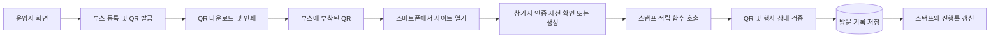

# 부스별 QR코드와 방문 스탬프

행사 참가자가 각 부스에 부착된 QR을 스마트폰으로 스캔하면, 사이트에서 해당 부스의 방문 스탬프를 받고 수집 현황을 바로 확인하는 웹 서비스.

> 현재 단계: 기존 사이트는 Vercel에서 운영 중이며 `boryeongculture.site` 연결을 확인했다. 부스 삭제·QR 일괄 생성·사이트 QR·WebP 썸네일·대형 완료 도장을 추가했다. 이번 변경의 배포 절차는 [배포 안내](docs/DEPLOYMENT.md)를 참고한다.

## 바로 실행하기

Node.js 22.12 이상이 필요하다. 의존성을 설치하고 실행한다.

```bash
npm ci
npm run dev
```

- 참가자 화면: `http://localhost:5173/`
- 운영자 체험: `http://localhost:5173/admin`
- QR 접속 체험: 참가자 화면의 **참여 방법 → 첫 부스 체험하기**
- 개별 QR: 운영자 화면에서 부스의 **QR** 버튼 → 다운로드 또는 링크 확인
- 일괄 인쇄: 운영자 화면의 **전체 QR 인쇄**
- 일괄 발급: **부스별 QR 일괄 생성**으로 QR이 없는 운영 부스에만 발급 (기존 QR 유지)
- 사이트 안내 QR: **사이트 접속 QR** → `boryeongculture.site` 접속용 QR 확인·다운로드·인쇄
- 부스 사진: 부스 추가·수정의 **썸네일 사진** 선택 → 자동 WebP 변환 → **부스 저장**
- 부스 삭제: 수정·QR 옆 **삭제** → 방문 기록과 QR 삭제 안내 확인

기본 실행은 **체험 모드**다. 샘플 부스 6개를 제공하고 기록과 설정을 현재 브라우저에 저장한다. 체험용 QR을 다른 기기로 열면 별도 체험 데이터가 생성되므로 현장 운영에 사용하지 않는다. 운영 모드는 Supabase 데이터베이스를 사용하며, 연결 실패 시 체험 모드로 전환하지 않는다.

실제 연결은 [Supabase 설정 및 배포 안내](docs/DEPLOYMENT.md)를 따른다. `.env.example`을 `.env.local`로 복사하고 `VITE_APP_MODE=live`, 프로젝트 URL, 공개용 키를 설정한다. 운영용 QR 발급에는 `VITE_PUBLIC_SITE_URL`에 최종 HTTPS 도메인이 필요하다.

### 구현된 기능

- 반응형 스탬프북, 방문 필터, 진행률, 전체 완료 시 첫 4개 카드(2×2)를 덮는 큰 도장. 부스가 4개 미만이면 해당 카드 영역에 표시.
- QR 링크에서 익명 참가자 인증, 자동 적립, 중복 방지, 실패 시 재시도.
- 페이지 재접속·탭 복귀 시 기록 재조회.
- 참가자 세션과 분리된 운영자 로그인, 행사 설정, 부스 추가·수정·비활성화·삭제. 삭제는 관련 QR·방문 기록을 함께 제거하므로 기록을 보존하려면 비활성화를 사용.
- QR PNG 다운로드, 원자적 QR 재발급, 누락된 QR 일괄 생성, 부스별·전체 A4 인쇄, 사이트 접속용 안내 QR.
- JPG·PNG·WebP 사진을 최대 512px·256KiB WebP로 변환해 Supabase Storage에 저장. DB에는 경로만 저장하며 교체·제거·부스 삭제 시 기존 파일 정리. 사진이 없거나 읽기 실패 시 아이콘 표시.
- Supabase 스키마·RLS·적립 함수·운영자 API와 참가자별 요청 제한.
- 선택적 Turnstile 인증 연동.

### 검증 명령

```bash
npm run build
npm test
npm run check:functions
npm run test:functions
npx playwright install chromium
npm run test:e2e
```

Linux에서 브라우저 라이브러리가 없다면 `npx playwright install-deps chromium`으로 준비한다. 브라우저 테스트는 체험 모드에서 실행한다. DB 테스트는 PGlite의 실제 PostgreSQL 엔진에서 마이그레이션과 권한을 검증하고, 함수 테스트는 인증 응답을 대체해 요청 경계를 검증한다. Supabase 실서비스 연결 테스트와 실제 휴대폰으로 인쇄물을 스캔하는 검증은 프로젝트·도메인 준비 후 별도로 진행해야 한다.

### 주요 파일

| 위치                   | 내용                                                |
| ---------------------- | --------------------------------------------------- |
| `src/pages/`           | 참가자, QR 처리, 운영자, 인쇄 화면                  |
| `src/lib/api.ts`       | Supabase 연결 및 참가자·운영자 세션 분리            |
| `src/lib/demo.ts`      | 운영 데이터와 분리된 로컬 체험 저장소               |
| `supabase/migrations/` | 테이블, 접근 권한, 중복 방지, 적립·QR 교체 트랜잭션 |
| `supabase/functions/`  | 인증된 사용자만 호출 가능한 Edge Functions          |
| `tests/`               | DB·입력 검증·함수 인증·브라우저 테스트              |
| `docs/DEPLOYMENT.md`   | 프로젝트 생성 후 연결, 운영자 등록, 배포 절차       |

아래는 구현의 기준이 된 개발 계획과 진행 상태다. 체크된 항목은 코드 구현 또는 명시된 로컬 검증 완료를 뜻하며, 실서비스 배포 완료를 뜻하지 않는다.

## 1. 목표와 요구사항

- 운영자가 부스 개수와 이름을 설정한다.
- 부스마다 고유한 QR을 생성하고, 출력해 현장에 부착한다.
- 참가자가 QR을 스캔해 링크를 열면 해당 부스의 스탬프가 자동으로 적립된다.
- 사이트에서 부스명, 획득한 스탬프, 전체 진행률을 즉시 확인한다.
- 직접 운영하는 별도 서버 없이, 오픈소스 기반 관리형 백엔드와 서버리스 함수를 사용한다.
- 도메인은 추후 별도로 확보해 연결한다.
- 디자인은 Apple 스타일을 참고해 여백, 명확한 타이포그래피, 단정한 카드와 부드러운 스탬프 애니메이션을 사용한다.

## 2. 초기 버전의 기본 정책

| 항목        | 계획                                                 |
| ----------- | ---------------------------------------------------- |
| 운영 단위   | 초기에는 행사 1개를 운영하되, 데이터는 행사별로 구분 |
| 참가자 식별 | 회원가입 입력 없이 익명 인증으로 참가자 ID 발급      |
| 적립 기준   | 동일 참가자는 행사 내 부스마다 스탬프 1개 획득       |
| 반복 스캔   | 개수를 추가하지 않고 이미 방문한 부스임을 표시       |
| 적립 시점   | 백엔드 저장 성공을 확인한 후 화면에 반영             |
| 인터넷 연결 | 적립에 필요하며, 연결 실패 시 재시도 제공            |
| QR 스캔     | 스마트폰 기본 카메라로 링크 열기                     |
| 운영자 접근 | 사전에 지정한 운영자 계정으로 로그인                 |

익명 참가자의 세션은 같은 브라우저에서 유지한다. 브라우저 데이터 삭제, 시크릿 모드, 다른 기기나 브라우저 사용 시 기존 참가자로 복구되지 않을 수 있다. 따라서 초기에는 같은 브라우저로 참여하도록 안내하고, 기기 간 복구가 필요하면 정식 로그인 방식을 추가한다. [Supabase 익명 인증 문서](https://supabase.com/docs/guides/auth/auth-anonymous)

고정된 인쇄 QR은 링크를 공유할 수 있으므로 실제 현장 방문을 완전히 증명하지는 못한다. 초기 버전은 이 방식으로 운영하며, 경품 지급 등으로 엄격한 방문 확인이 필요하면 직원 확인이나 추가 인증을 별도로 설계한다.

## 3. 기술 구성

| 영역         | 제안                            | 역할                                     |
| ------------ | ------------------------------- | ---------------------------------------- |
| 프론트엔드   | React + TypeScript + Vite       | 모바일 중심의 정적 웹 앱                 |
| 디자인       | CSS                             | Apple 스타일의 반응형 화면과 스탬프 효과 |
| 데이터베이스 | Supabase 관리형 PostgreSQL      | 행사, 부스, QR, 방문 기록 저장           |
| 인증         | Supabase Auth                   | 익명 참가자와 운영자 로그인              |
| 백엔드 로직  | Supabase Edge Functions         | QR 검증, 스탬프 적립, 운영자 작업 처리   |
| 접근 제어    | PostgreSQL RLS 및 API 권한 검사 | 본인 기록 조회와 운영자 권한 구분        |
| QR 이미지    | qrcode                          | 부스별 QR 이미지와 인쇄 화면 생성        |
| 웹 호스팅    | Vercel                          | `qr-booth.vercel.app` 정적 웹 배포       |

Supabase는 오픈소스 기반 플랫폼이며, Edge Functions로 별도 애플리케이션 서버를 운영하지 않고 로직을 실행할 수 있다. 이 계획에서는 자체 설치 대신 관리형 서비스를 사용한다. 데이터베이스는 관리형 PostgreSQL이고, 사용자 정의 API 실행을 서버리스로 구성한다. [Supabase 소개](https://supabase.com/) · [Edge Functions 문서](https://supabase.com/docs/guides/functions)

웹 호스팅은 Vercel을 사용한다. 최초 배포 절차와 환경 변수는 [배포 안내](docs/DEPLOYMENT.md#6-vercel에-배포하기)에 정리했다. `vercel.json`에서 QR 하위 경로와 응답 헤더를 설정한다.

### 전체 흐름



## 4. 화면과 기능

### 참가자 스탬프 페이지

- 행사명과 참여 방법을 표시한다.
- 등록된 부스의 이름과 스탬프를 카드 형태로 표시한다.
- 미방문·방문 완료 상태를 아이콘과 문구로 구분한다.
- `획득한 스탬프 수 / 전체 대상 부스 수`와 진행률을 표시한다.
- QR 처리 성공 시 해당 카드에 스탬프 애니메이션을 보여준다.
- 적립 요청 결과를 받은 즉시 데이터를 갱신해 수동 새로고침 없이 확인할 수 있게 한다.
- 기존 탭으로 돌아왔을 때도 최신 기록을 다시 조회한다.
- 전체 스탬프를 모으면 완료 메시지를 표시한다.

### QR 처리 페이지

- URL 예시: `https://<최종 도메인>/e/<행사 식별자>/scan/<QR 토큰>`
- 링크가 열리면 기존 세션을 확인하고, 세션이 없으면 익명 인증을 진행한다.
- 인증 준비 후 QR 토큰을 스탬프 적립 함수로 전달한다.
- 결과에 따라 신규 적립, 이미 적립됨, 유효하지 않은 QR, 운영 기간 종료를 표시한다.
- 인증이나 통신 실패 시 해당 QR 정보를 유지하고 재시도할 수 있게 한다.
- 처리가 끝나면 해당 부스가 강조된 스탬프 페이지로 이동한다.

### 운영자 페이지와 QR 생성기

- 운영자 로그인과 권한 확인.
- 행사 이름, 운영 기간, 공개 상태 설정.
- 부스 추가, 이름 수정, 표시 순서 변경, 활성 여부 설정.
- 부스별 고유 QR 발급, 이미지 다운로드, 전체 부스 인쇄 화면 제공.
- 인쇄물에 행사명, 부스명, QR, 짧은 참여 안내를 함께 표시.
- 충분한 QR 여백과 대비를 확보하고 실제 출력물로 인식 여부 확인.
- QR 재발급 시 이전 토큰을 폐기하고 해당 부스의 인쇄물 교체 안내.
- 기존 기록을 보존하려면 부스를 비활성화한다. 삭제를 확인하면 해당 부스의 QR과 방문 기록도 함께 영구 삭제된다.

부스 개수는 등록된 부스 목록으로 관리한다. 행사 시작 전에 수집 대상 부스를 확정하고, 진행 중 대상 부스를 변경하면 전체 진행률과 완료 기준도 달라질 수 있음을 운영자에게 표시한다.

## 5. 데이터와 접근 권한

| 데이터           | 주요 필드                                              | 용도                                   |
| ---------------- | ------------------------------------------------------ | -------------------------------------- |
| `events`         | `id`, `slug`, `name`, `starts_at`, `ends_at`, `status` | 행사 설정                              |
| `booths`         | `id`, `event_id`, `name`, `sort_order`, `is_active`    | 행사별 부스 목록                       |
| `auth.users`     | `id`                                                   | Supabase가 관리하는 참가자·운영자 계정 |
| `admin_users`    | `user_id`                                              | 사전 지정한 운영자 권한                |
| `booth_qr_codes` | `id`, `booth_id`, `token`, `is_active`, `created_at`   | 부스별 QR 발급 및 폐기                 |
| `stamps`         | `id`, `participant_id`, `booth_id`, `created_at`       | 참가자의 부스 방문 기록                |

- `stamps`의 `(participant_id, booth_id)`에 유일성 제약을 둬 동시에 요청해도 중복 저장되지 않게 한다.
- 스탬프 총개수는 방문 기록에서 계산한다. 단순 카운터 증가 방식으로 저장하지 않는다.
- 참가자는 공개된 행사·부스 정보와 본인의 스탬프만 조회할 수 있다.
- 참가자에게 스탬프 직접 추가·수정·삭제 권한을 주지 않고 검증된 적립 함수로만 기록한다.
- QR 토큰은 충분히 긴 난수로 발급하고, 일반 부스 목록 응답에는 포함하지 않는다.
- QR 원문은 재다운로드를 위해 별도 테이블에 보관하고, 운영자와 백엔드만 조회하도록 제한한다.
- 운영자 여부는 백엔드에서 확인하고, `admin_users`는 클라이언트가 수정하지 못하게 한다.
- 브라우저에는 공개용 키만 사용하고, 관리자용 비밀 키는 서버리스 환경에 보관한다.

조회 권한은 [Supabase RLS](https://supabase.com/docs/guides/database/postgres/row-level-security)를 기준으로 설정하고, 키 구분은 [API 키 문서](https://supabase.com/docs/guides/getting-started/api-keys)를 따른다.

## 6. 스탬프 적립 처리

스탬프 적립 API는 `POST /functions/v1/claim-stamp` 형태의 Edge Function으로 구현한다. 운영자 작업은 `POST /functions/v1/admin-action`에서 처리한다.

1. 브라우저가 참가자 인증 토큰과 행사 식별자, QR 토큰을 전달한다.
2. 함수는 인증 토큰을 검증해 참가자 ID를 결정한다. 요청 본문의 참가자 ID는 신뢰하지 않는다.
3. QR이 해당 행사의 활성 부스에 연결되어 있는지, 행사 운영 기간인지 확인한다.
4. 유일성 제약을 이용해 방문 기록을 원자적으로 추가한다. 기존 기록이 있으면 중복 결과로 처리한다.
5. 저장된 방문 기록과 적립 결과를 반환한다.
6. 브라우저가 서버에 저장된 스탬프 목록을 다시 조회해 카드와 진행률을 갱신한다.

단순 URL 조회나 링크 미리보기용 GET 요청은 적립을 발생시키지 않는다. 페이지에서 참가자 인증을 완료한 뒤 POST 요청으로 처리한다. 네트워크 오류로 같은 요청을 다시 보내도 스탬프는 1개만 유지되어야 한다.

## 7. 배포와 도메인 연결

1. 개발용 Supabase 프로젝트와 정적 웹 호스팅을 준비한다.
2. 임시 배포 주소로 참가자 화면, 운영자 화면, 테스트 QR 흐름을 확인한다.
3. 별도로 확보한 최종 도메인을 호스팅에 연결하고 HTTPS를 확인한다.
4. QR 생성 기준 주소를 최종 도메인으로 설정한다.
5. 인증 관련 사이트 주소, 리디렉션 허용 주소, API의 허용 출처 설정을 점검한다.
6. `/e/<행사 식별자>/scan/<QR 토큰>`으로 직접 접속하거나 새로고침해도 앱이 열리는지 확인한다.
7. 최종 주소로 운영용 QR을 생성하고, 실제 스마트폰과 출력물로 검증한 뒤 부스에 부착한다.

인쇄 QR에는 도메인이 고정되므로 **최종 도메인 연결 후 운영용 QR을 출력**한다. 개발 중 생성한 QR은 테스트용으로 구분한다. 도메인이 바뀌면 브라우저의 익명 인증 세션도 자동 이전되지 않으므로, 실제 참가자 모집 전에 주소를 확정한다.

최초 배포 주소는 `https://qr-booth.vercel.app`이다. 직접 URL 접속은 [Vercel Vite 배포 안내](https://vercel.com/docs/frameworks/frontend/vite)에 따라 `vercel.json`의 SPA rewrite로 처리한다. 별도 도메인을 연결할 경우 QR 기준 주소와 Supabase 허용 출처도 변경한다.

## 8. 단계별 개발 계획

### 1단계: 프로젝트와 화면 골격

- [x] React + TypeScript + Vite 프로젝트 구성
- [x] 모바일 중심의 Apple 스타일 디자인 기준 설정
- [x] 스탬프 페이지, QR 처리 페이지, 운영자 페이지 라우팅 구성
- [x] 샘플 부스로 스탬프 카드와 진행률 화면 구현

### 2단계: 데이터베이스와 참가자 인증

- [x] 데이터베이스 마이그레이션 작성 및 PostgreSQL 엔진에서 검증
- [x] 행사·부스·QR·스탬프·운영자 테이블 구성
- [x] 익명 인증과 기존 세션 재사용 구현
- [x] 본인 기록 조회 정책과 중복 방지 제약 적용
- [x] 운영자 권한 검사 및 계정 등록 절차 작성
- [x] Supabase 프로젝트 연결·마이그레이션 적용 확인
- [x] Edge Functions 배포 및 Vercel 주소의 API 호출 허용
- [ ] 운영자 계정 등록 확인

### 3단계: QR 적립 흐름

- [x] `claim-stamp` 함수와 인증·QR·운영 기간 검증 구현
- [x] 최초 QR 접속부터 인증, 적립, 화면 갱신까지 연결
- [x] 중복 스캔, 잘못된 QR, 비활성 부스, 행사 종료 처리
- [x] 통신 실패·응답 유실 시 재시도와 탭 복귀 시 재조회 구현
- [x] 적립 애니메이션과 전체 수집 완료 표시

### 4단계: 부스 관리와 출력

- [x] 행사 및 부스 설정 화면 구현
- [x] 부스별 QR 발급·재발급·다운로드 구현
- [x] 여러 부스의 QR을 한 번에 출력하는 인쇄 화면 구현
- [x] 운영자 권한 없는 사용자의 관리 작업 차단 테스트

### 5단계: 현장 검증과 배포

- [x] 로컬 체험 모드에서 데스크톱·모바일 참여 흐름 검증
- [ ] Supabase 연결 후 임시 배포 주소에서 전체 참여 흐름 검증
- [ ] 실제 예상 참가자 수와 행사장 공용 Wi-Fi 환경에 맞춰 인증·API 한도 확인
- [ ] 익명 인증 남용 방지 설정과 요청 제한이 정상 참여를 막지 않는지 확인
- [ ] 최종 도메인 연결, HTTPS 및 QR 직접 접속 검증
- [ ] iOS·Android 기본 카메라와 주요 모바일 브라우저로 출력물 테스트
- [x] 체험 모드와 운영 모드의 저장소 분리
- [x] 운영자 사용 방법과 출력 절차 정리
- [ ] 운영용 QR 출력·현장 부착

## 9. 초기 버전 완료 기준

- 운영자가 부스를 추가하거나 이름을 바꾸면 참가자 화면에 반영된다.
- 부스마다 서로 다른 QR을 다운로드하고 인쇄할 수 있다.
- 처음 방문한 참가자도 QR 링크를 열면 인증과 적립이 자동으로 이어진다.
- 서로 다른 부스를 방문하면 각 부스의 스탬프가 1개씩 쌓인다.
- 같은 QR의 반복 스캔, 새로고침, 동시 요청에도 중복 적립되지 않는다.
- 저장 성공 후 수동 새로고침 없이 스탬프가 표시되고, 재접속 시에도 기록이 유지된다.
- 통신 실패 시 성공으로 표시하지 않으며, 재시도 후 저장 상태가 일치한다.
- 다른 참가자의 기록 조회와 운영자 기능 접근이 차단된다.
- 폐기한 QR과 운영 기간 밖의 요청은 새 스탬프를 만들지 않는다.
- 최종 도메인이 들어간 실제 인쇄 QR로 전체 흐름이 동작한다.

## 10. 구현 전 또는 운영 전에 확정할 사항

- 행사명, 부스 수와 이름, 행사 운영 기간.
- 예상 참가자 수와 동시 접속 규모, 호스팅·백엔드 예산.
- 익명 참여만으로 충분한지, 기기 변경 시 기록 복구가 필요한지.
- 전체 수집 시 완료 화면만 제공할지, 별도 경품 수령 절차가 필요한지.
- 사용할 도메인과 운영자 계정.

현장 방문 추가 인증, 경품 지급 관리, 실시간 운영 통계, 사이트 내부 카메라 스캐너는 초기 버전 이후 필요에 따라 확장한다.
